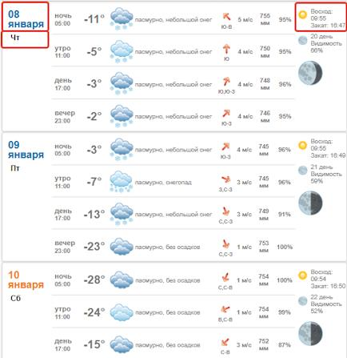

# LABRAB_01  

## Работа с Регулярными выражениями  

---  

### Задание 01  

Пусть в программе вводится строковая переменная - Фамилия Имя Отчество пользователя:  

```js
const user = "Иванов Иван Иванович";
```

Требуется с помощью регулярных выражений и метода .replace() вывести в консоль - Имя Фамилия:  

```txt
Иван Иванов
```

Сделать двумя техниками выборки:  

- нумерованные группы  
- именованные группы  

---  

### Задание 02  

Пусть в строке программы задан объект:  

```js
    let json = `
        { 
            "a": 1, 
            "b":   { "c": 2, "d": 3 }, 
            "e": 4, 
            "fff":{ "v": 10 } 
        };`;
```

Необходимо с помощью регулярных выражений достать из строки программы из объекта только поля, у которых значение типа объект.  
В строке нет полей, которые содеражат объекты с полями типа объект. То есть все поля-объекты являются плоскими объектами (для упрощения задания).  

Требуется вывести на экран:  

1) только сами значения полей (объекты), например массивом  

> `[ '{ "c": 2, "d": 3 }', '{ "v": 10 }' ]`  

2) только имена полей  

> `[ 'b', 'fff' ]`  

3) массив пар - имена полей и их значения (объекты):  

> `[ [ 'b', '{ "c": 2, "d": 3 }' ], [ 'fff', '{ "v": 10 }' ] ]`  

---  

### Задание 03  

Файл `task_03.txt` содержит одну длинную строку (длиной не более 100 тыс. символов) - в этой строке содержатся только заглавные буквы латинского алфавита и десятичные цифры в случайном порядке. Найдите подстроки максимальной длины, которые задают `запись чётного числа в шестнадцатиричной системе счисления` (не допускаются ведущие нули в такой записи, например - 0F18, корректное число - F18). Среди таких строк максимальной длины определите `число максимальной величины` и выведите в консоль.  

> алфавит шестнадцатиричной системы счисления: 0123456789ABCDEF  
> решение оформить с использованием `регулярных выражений`  

---  

### Задание 04  

Очевидно, что парсить данные с html-страниц удобнее с помощью специализированных библиотек, но в этом задании для получения практики преодоления сложностей с регулярками вам предстоит спарсить данные с сайта: https://pogoda7.ru/prognoz/gorod701-Russia-Permskiy_kray-Perm  

  

Требуется с сайта:  
- собрать от текущего дня на неделю вперёд данные - `дата`, `день недели`, время `восхода` и `заката`  
- и вывести в консоль примерно в таком формате:  

```txt
06 января  Вт  Восход: 09:57  Закат: 16:44
07 января  Ср  Восход: 09:56  Закат: 16:45
08 января  Чт  Восход: 09:55  Закат: 16:47
09 января  Пт  Восход: 09:55  Закат: 16:49
10 января  Сб  Восход: 09:54  Закат: 16:50
11 января  Вс  Восход: 09:53  Закат: 16:52
12 января  Пн  Восход: 09:51  Закат: 16:54
13 января  Вт  Восход: 09:50  Закат: 16:56
```

**Особенности выполнения**:  

- саму html-страницу загружать можно любым адекватным методом (из изученных в предыдущем семестре)  
- сохранить html-страницу локально на компьютер (чтобы не загружать тестовыми запусками используемый сайт)  
- далее решать Задание, выбирая данные из локального html-файла  
- сбор данных по странице обязательно делать **с помощью регулярок**  
- желательно задачу разбить на две части, примерно так:  
  - `const arrSunTime = getSunTime(text);`  
  - `const arrDate = getDate(text);`  
- это нужно для удобства контроля и модификации  
- затем уже, объединяя данные из двух массивов, выводить на экран  

---  
